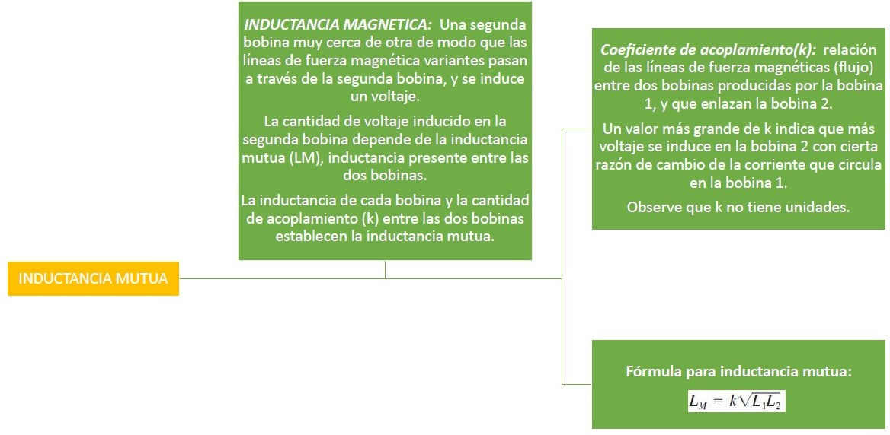
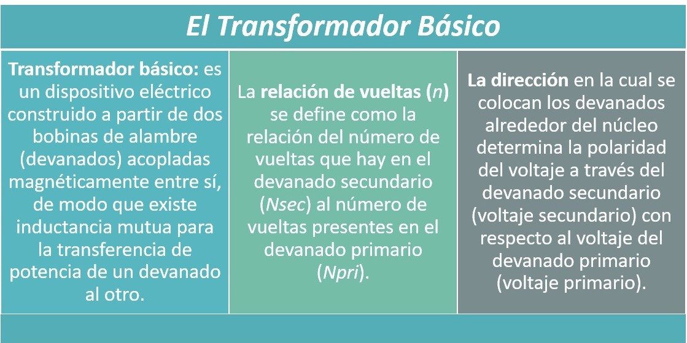

# Trabajo de Investigacion 3

1. OBJETIVOS

_Objetivos Generales:_

• Estudiar la inductancia mutua, la base para la operación de transformadores. Analizar el uso de transformadores en todo tipo de aplicaciones como fuentes de potencia, distribución de potencia eléctrica, y acoplamiento de señales en sistemas de comunicaciones. Entender la operación del transformador haciendo uso del principio de inductancia mutua. 

• Identificar terminos claves que se usaran en el transcurso de esta investigación, para una mejor compresión y análisis. 

_Objetivos Específicos:_

• Comprender el funcionamiento y utlidad de los transformadores 

• Explicar la inductancia mutua
 
• Describir cómo se construye un transformador y cómo funciona

• Describir cómo los transformadores incrementan y disminuyen el voltaje

•	Analizar el efecto de una carga resistiva a través del devanado secundario.

•	Analizar el concepto de carga reflejada en un transformador.

•	Analizar la igualación de impedancias con transformadores.

• Investigar la relación entre el voltaje de entrada y el de salida con el número de vueltas en el
primario y secundario del transformador

2. MARCO TEÓRICO

3. Diagramas

CARGA DEL DEVANADO SECUNDARIO

CARGA REFLEJADA

IGUALACIÓN DE IMPEDANCIA

4. Explicación

5. Conclusiones:
  
-	Se conoció una diferencia fundamental en la construcción de transformadores, la cual depende de la forma del núcleo, el sistema de enfriamiento, o bien en términos de su potencia y voltaje para aplicaciones, como por ejemplo clasificar en transformadores de potencia a tipo distribución. 

-	Las polaridades relativas de los voltajes primario y secundario son determinadas por la dirección de los devanados alrededor del núcleo. La relación de vueltas de un transformador elevador es mayor que 1. Y la relación de vueltas de un transformador reductor es menor que 1.

-	Gracias a los transformadores, la distribución de energía eléctrica se ha aprovechado y distribuido desde centrales eléctricas a diferentes ciudades del mundo

-	Se conoció que la razón de transformación del voltaje entre el bobinado primario y el segundario depende del número de vueltas que tenga cada uno.

-	La conversión de energía eléctrica en calor en un transformador real se deriva de las resistencias de los devanados, de la pérdida por histéresis en el núcleo, de las corrientes parásitas en el núcleo, y de la fuga de flujo.

6. Bibliografía 

•	Floyd Thomas L, “Principios de Circuitos Eléctricos”, 8 ed. 2007. Pearson Educación de México, S.A. de C.V. México, pp. 563-599.

• Kosow, I. L. (1993). Máquinas eléctricas y transformadores. Pearson Educación.

• Alcorta-Garcıa, E., Elizondo-González, C., San Nicolás de los Garza, N., Pérez-Rojas, C., & Avalos-González, A. Deteccion de Fallas en Transformadores Eléctricos.

• Fundacion Endesa. El Trasformador Electrico (2019). Recuperado de : https://www.fundacionendesa.org/es/recursos/a201908-corrientes-alternas-con-un-transformador-electrico
